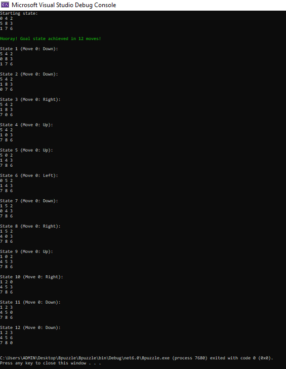
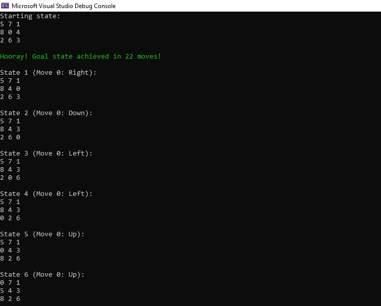

# 8 Puzzle Solver using C#

## Description
This is my university AI course (Spring 2023) project and I implemented two methods to solve the classic 8-puzzle problem:

1. **[Random Moves Method:](8puzzle/RandomSolver.cs)** Moves the empty space randomly until the puzzle is solved. I did this for the assignment, but it is not recommended as it may take forever 🙂

2. **[A\* Search Algorithm:](8puzzle/AStarSolver.cs)**  The A* search algorithm is an efficient pathfinding algorithm used to solve graph-based problems like the 8-puzzle.
It works by maintaining a priority queue of nodes to visit, where the priority is determined by the estimated total cost of reaching the goal through that node.

### Key components of the A* algorithm:

- **Heuristic Function (h(n)):** Estimates the distance from a given node to the goal. For the 8-puzzle, we use the Manhattan distance heuristic, which calculates the sum of the distances of each tile from its goal position.

- **Cost Function (g(n)):** Represents the cost of reaching the current node from the starting node. In our case, it's simply the number of moves made so far.

- **Total Cost Function (f(n)):** Combines the heuristic and cost functions: f(n) = g(n) + h(n).
This determines the priority of each node in the queue.

The initial state of the puzzle is generated randomly each time you run the program, providing a unique challenge each time.

#### Goal State

*It is assumed that the goal state is:*
    
     1 2 3
     4 5 6
     7 8 0
     
## Screenshots

Here are some screenshots of the A* algorithm solving 8-puzzle in action:

